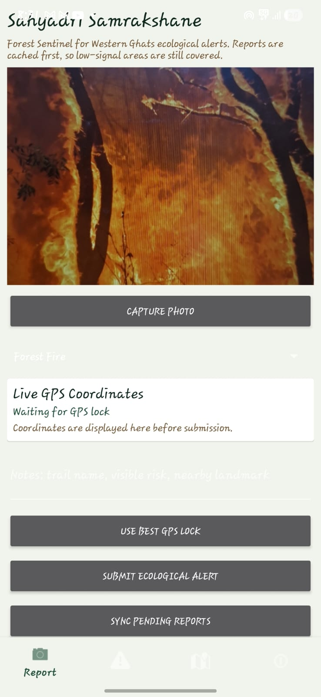
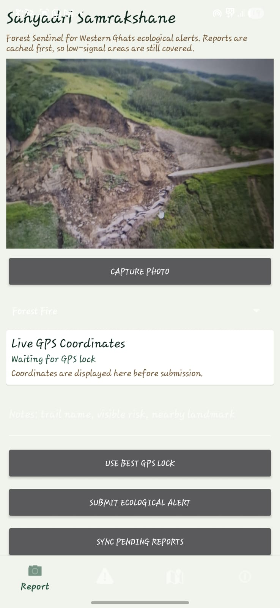
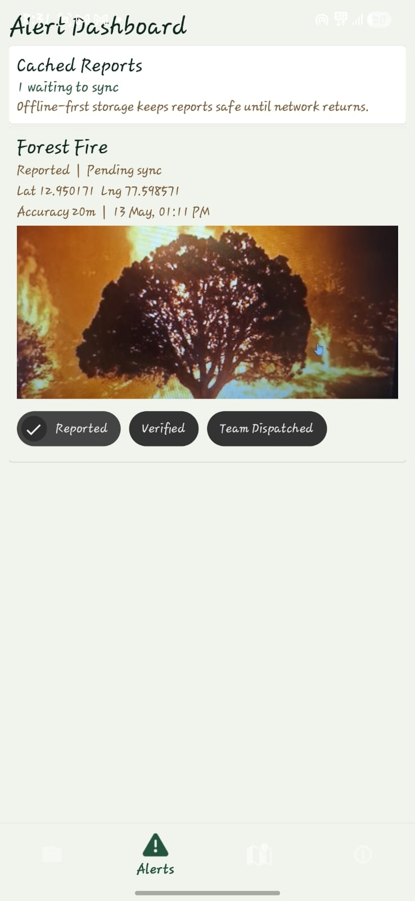
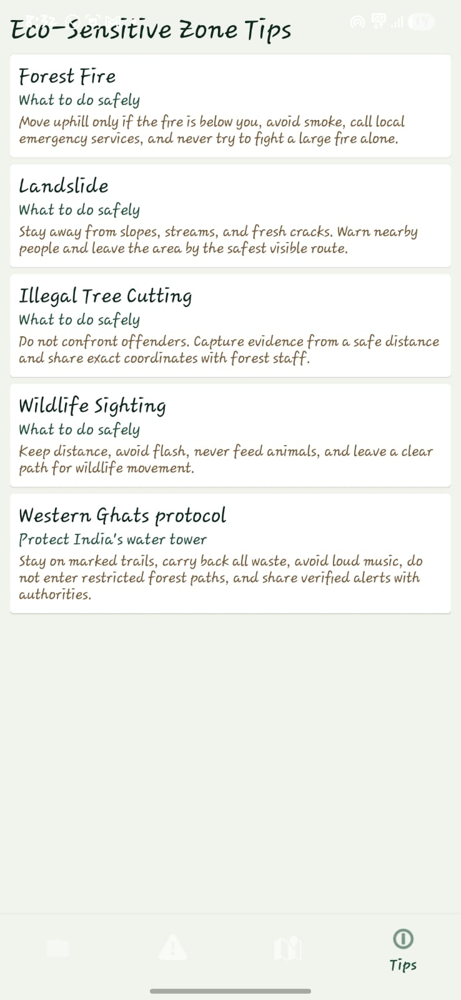

<h1 align="center">🌿 Sahyadri Samrakshane</h1>

  <b>Forest Sentinel for Western Ghats Ecological Alerts</b> 
  A Kotlin Android application that enables citizens, trekkers, and local communities to report ecological threats in real time with GPS coordinates and photo evidence.

<h2>📌 Problem Statement</h2>

The Western Ghats are one of India’s most eco-sensitive regions. Local communities often notice forest fires, illegal logging, landslides, or wildlife threats before authorities do, but there is no fast and direct reporting system available with exact location tracking.

<b>Sahyadri Samrakshane</b> is designed as a citizen-science environmental protection platform that helps users instantly report ecological alerts using:

<ul>
  <li>📸 Photo Evidence</li>
  <li>📍 High Accuracy GPS Coordinates</li>
  <li>📶 Offline Report Caching</li>
  <li>☁️ Firebase Cloud Sync</li>
</ul>

The goal is to help forest officials and disaster response teams react quickly before the damage becomes severe.

<h2>🌍 Vision</h2>

Sahyadri Samrakshane acts as a digital <b>"Forest Sentinel"</b> for the Western Ghats.
The app empowers local communities and trekkers to actively participate in:

<ul>
  <li>🌲 Forest Protection</li>
  <li>🚨 Disaster Management</li>
  <li>🛡️ Community Environmental Policing</li>
  <li>💧 Protecting India’s Water Tower (Western Ghats)</li>
</ul>

<h2>✨ Features Implemented</h2>

<ul>
  <li>🌿 Nature-friendly UI using earth and green tones</li>
  <li>📸 CameraX-based ecological evidence capture</li>
  <li>📍 Live GPS coordinates with accuracy tracking</li>
  <li>🗂️ Offline Room Database caching support</li>
  <li>🔄 WorkManager background synchronization</li>
  <li>☁️ Firebase Firestore integration</li>
  <li>🧭 Alert map visualization</li>
  <li>📚 Eco-sensitive awareness & safety tips</li>
  <li>📶 Low-signal area support</li>
</ul>

<h2>🚨 Supported Alert Types</h2>

<ul>
  <li>🔥 Forest Fire</li>
  <li>⛰️ Landslide</li>
  <li>🪓 Illegal Tree Cutting</li>
  <li>🐘 Wildlife Sighting</li>
</ul>

<h2>📱 Application Screens</h2>

<h3>📸 Ecological Alert Reporting Screen</h3>

  
  &nbsp;&nbsp;
  

<ul>
  <li>Capture ecological evidence using CameraX</li>
  <li>Fetch high-accuracy GPS coordinates</li>
  <li>Store reports offline during low connectivity</li>
</ul>

<h3>🚨 Alert Dashboard</h3>

  

<ul>
  <li>View synced and pending reports</li>
  <li>Track alert status:
    <ul>
      <li>Reported</li>
      <li>Verified</li>
      <li>Team Dispatched</li>
    </ul>
  </li>
</ul>

<h3>📚 Eco-Sensitive Zone Tips</h3>

  

<ul>
  <li>Forest fire safety guidance</li>
  <li>Landslide awareness</li>
  <li>Wildlife protection guidelines</li>
  <li>Western Ghats eco-protection rules</li>
</ul>

<h2>🛠️ Tech Stack</h2>

<table>
  <tr>
    <th>Technology</th>
    <th>Purpose</th>
  </tr>

  <tr>
    <td>Kotlin</td>
    <td>Android App Development</td>
  </tr>

  <tr>
    <td>Jetpack Compose / Android UI</td>
    <td>Modern Android User Interface</td>
  </tr>

  <tr>
    <td>CameraX</td>
    <td>High-resolution photo capture</td>
  </tr>

  <tr>
    <td>FusedLocationProviderClient</td>
    <td>Accurate GPS location tracking</td>
  </tr>

  <tr>
    <td>Room Database</td>
    <td>Offline report caching</td>
  </tr>

  <tr>
    <td>WorkManager</td>
    <td>Background synchronization</td>
  </tr>

  <tr>
    <td>Firebase Firestore</td>
    <td>Cloud database sync</td>
  </tr>

  <tr>
    <td>Google Maps API</td>
    <td>Alert location visualization</td>
  </tr>
</table>

<h2>📂 Project Structure</h2>

<pre>
SahyadriSamrakshane/
│
├── .kotlin/
│
├── app/
│   ├── src/main/java/com/sahyadri/samrakshane/
│   │   ├── ui/
│   │   ├── screens/
│   │   ├── database/
│   │   ├── workers/
│   │   ├── firebase/
│   │   ├── location/
│   │   └── camera/
│   │
│   ├── res/
│   └── AndroidManifest.xml
│
├── gradle/
│   └── wrapper/
│
├── screenshots/
│
├── .gitignore
├── README.md
├── build.gradle.kts
├── settings.gradle.kts
├── gradle.properties
├── gradlew
└── gradlew.bat
</pre>

<h2>⚙️ Firebase Setup</h2>

<h3>1️⃣ Enable Firebase Services</h3>

<ul>
  <li>Enable <b>Cloud Firestore</b></li>
  <li>Enable <b>Anonymous Authentication</b></li>
</ul>

<h3>2️⃣ Add Firebase Configuration</h3>

Download <code>google-services.json</code> from Firebase Console and place it inside:

<pre>
app/google-services.json
</pre>

<h3>3️⃣ Firestore Collection</h3>

Reports automatically sync into:

<pre>
ecological_alerts
</pre>

<h2>🗺️ Google Maps Setup</h2>

Add your Google Maps API key inside:

<pre>
local.properties
</pre>

<pre>
MAPS_API_KEY=YOUR_GOOGLE_MAPS_API_KEY
</pre>

<h2>▶️ How to Run the Project</h2>

<h3>Requirements</h3>

<ul>
  <li>Android Studio</li>
  <li>JDK 17 / Embedded JDK</li>
  <li>Android Emulator or Physical Device</li>
  <li>Google Play Services Enabled</li>
</ul>

<h3>Run Steps</h3>

<ol>
  <li>Open Android Studio</li>
  <li>Select <b>File → Open</b></li>
  <li>Open the project folder</li>
  <li>Wait for Gradle Sync</li>
  <li>Add Firebase and Maps configuration</li>
  <li>Run the app on an emulator or Android phone</li>
  <li>Grant Camera and Location permissions</li>
</ol>

<h2>📶 Offline First Architecture</h2>

The app is designed to work in remote forest regions with weak network coverage.

<ul>
  <li>Reports are first saved locally using Room Database</li>
  <li>WorkManager automatically syncs pending reports when internet becomes available</li>
  <li>No ecological report is lost due to poor connectivity</li>
</ul>

<h2>✅ Success Criteria Achieved</h2>

<table>
  <tr>
    <th>Requirement</th>
    <th>Status</th>
  </tr>

  <tr>
    <td>Works in low signal areas</td>
    <td>✅ Implemented using Room + WorkManager</td>
  </tr>

  <tr>
    <td>GPS coordinates shown on screen</td>
    <td>✅ Live latitude, longitude & accuracy displayed</td>
  </tr>

  <tr>
    <td>Nature-friendly UI</td>
    <td>✅ Green and earth-tone design</td>
  </tr>

  <tr>
    <td>Firebase synced dashboard</td>
    <td>✅ Firestore integration completed</td>
  </tr>

  <tr>
    <td>Kotlin implementation</td>
    <td>✅ Entire application built in Kotlin</td>
  </tr>
</table>

<h2>🎯 Impact Goals</h2>

<ul>
  <li>🌲 Environmental Security</li>
  <li>🚨 Early Disaster Reporting</li>
  <li>👥 Community Participation</li>
  <li>🛡️ Forest Resource Protection</li>
</ul>

<h2>🚀 Future Enhancements</h2>

<ul>
  <li>🔔 Push notifications for nearby alerts</li>
  <li>🛰️ Satellite forest monitoring integration</li>
  <li>🤖 AI-based fire and landslide prediction</li>
  <li>📊 Real-time admin analytics dashboard</li>
  <li>🌐 Multi-language support for local communities</li>
</ul>

<h2>👨‍💻 Developed By</h2>

<b>Roshan S</b> 
Computer Science & Engineering Student 
Mind Matrix, Karnataka

<h2>📜 License</h2>

This project is developed for educational, environmental, and social impact purposes.

